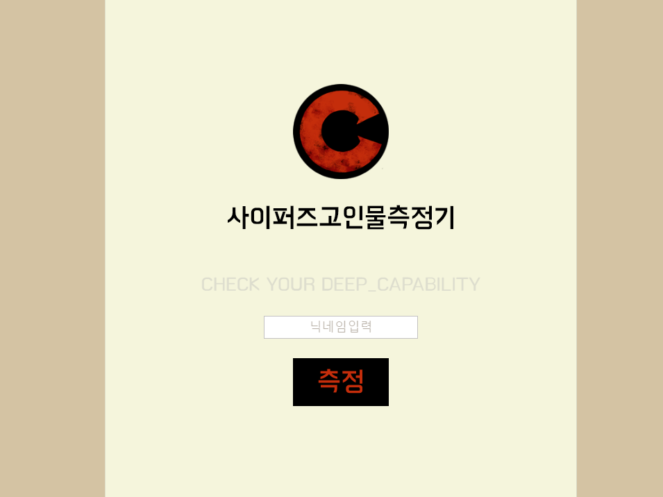
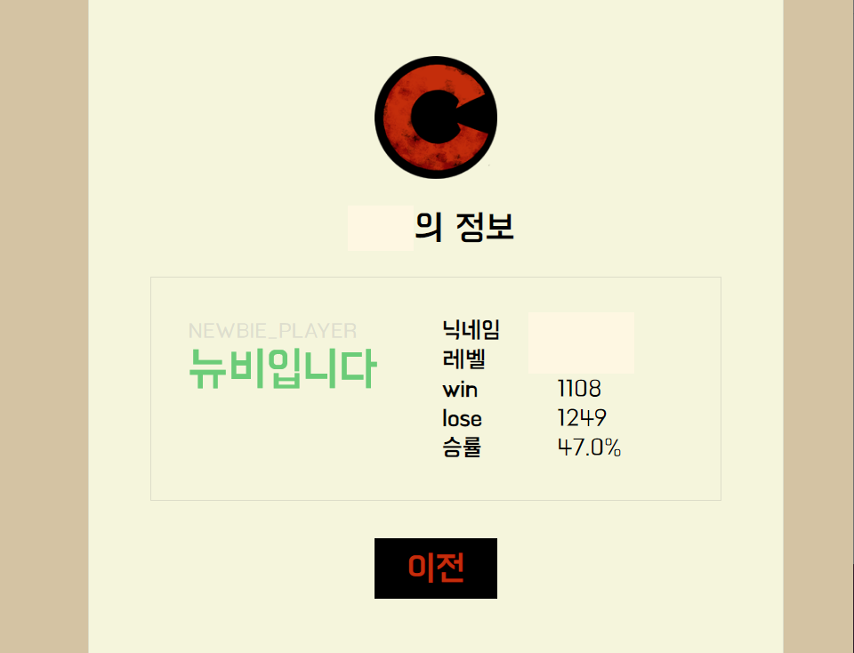
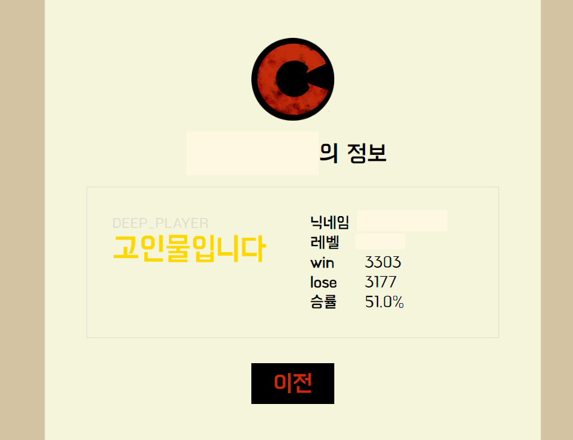

# DEEP_PLAYER

### 제작기간
 2020.03.16. ~ 2020.03.18.

### 기획개요  

게임의 API를 이용하여 유저들의 승률정보와 플레이횟수를 토대로 뉴비와 고인물의 기준을 판단해주는 프로그램을 만들고 싶었다.  
같이 게임하는 고인물 친구가 뉴비라고 주장하는것에 대한 반박으로 시작되었다.

### 개발환경 및 사용기술
- Windows10
- Intellij
- Tomcat
- MySQL
- JSP  
- Cyphers OpenAPI

 ### 서비스구조  
 

1. 닉네임을 입력한다.  
   
2. API에서 닉네임에 해당하는 정보를 JSON형식으로 받아온다.
   
3. 불러들인 데이터를 잘 가공하여 DB에 저장한다.
   
4. DB에서 정보를 불러들인다.

5. 설정한 기준에 따라 상태정보를 출력해준다.

---
- 뉴비일경우

 

 

- else
  

### 이 프로젝트를 통해

***API*** 를 사용해보고  
***MySQL*** 과 ***Tomcat*** 등을 사용해보며  
웹과 서버, 데이터베이스등의 지식을 쌓을 수 있었다.  

친구에게 배포를 하기 위해, 공유기의 *포트포워딩* 을 사용해 링크를 생성하고 보내주었다.

